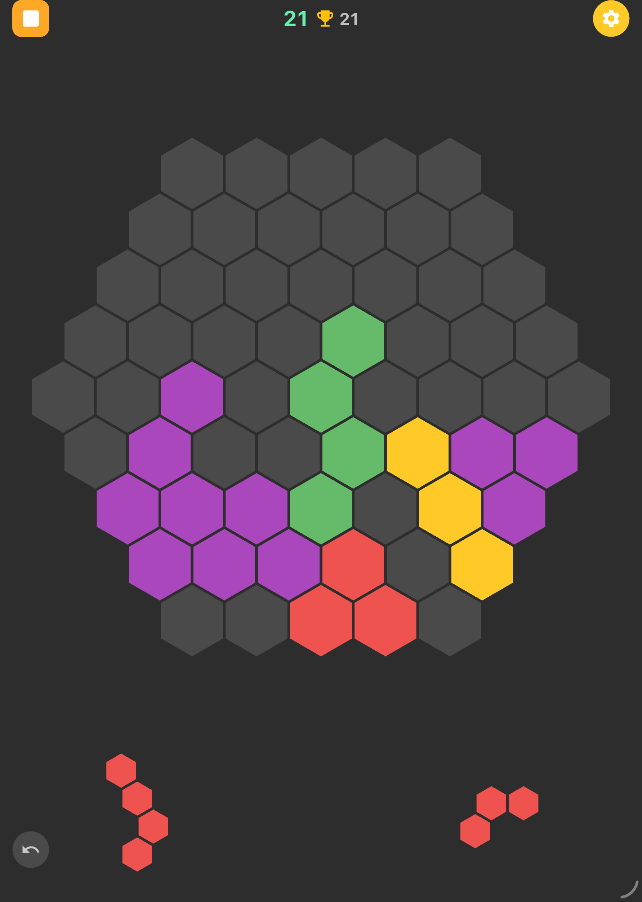

# Hexris

A replica of the now-deprecated iOS puzzle game **Hexris**, rebuilt from scratch using Flutter/Dart.

The original game featured two block-puzzle modes — a classic 10x10 square grid and a hexagonal grid — where players drag and drop pieces to fill and clear lines. Since the original app is no longer available on the App Store, this project recreates the gameplay and visual style for iPad.

## Screenshot

<p align="center">
  
</p>

## Features

- **Two game modes**: Square (10x10 grid) and Hex (radius-5 hexagonal grid with 61 cells)
- **Drag-and-drop** pieces from a 3-piece tray onto the board
- **Line clearing**: complete rows/columns (square) or any of 3 hex axes to clear cells
- **Undo**: take back your last move(s)
- **Scoring**: points per cell placed, bonus for multi-line clears
- **High score** tracking per mode

## Building

```bash
flutter run          # run on connected device
flutter run -d macos # run on macOS desktop
```

Requires Flutter SDK 3.x+.
