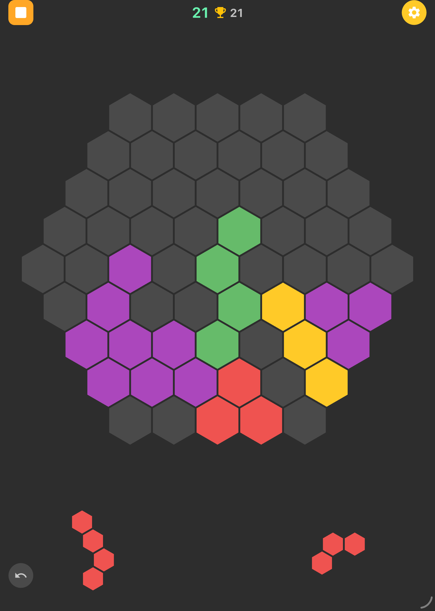

# Hexris

A block-puzzle game for iPad, built with Flutter/Dart. Inspired by a now-deprecated iOS game that is no longer available on the App Store — this project recreates its gameplay and visual style from scratch.

The game features two board modes — a classic 10x10 square grid and a
61-cell hexagonal grid — where players drag and drop pieces to fill and clear
lines. It starts with the reverse-engineered Block Crush Blitz 1.7 ruleset;
the earlier Hexris rules remain available from Settings.

## Screenshot

<p align="center">
  
</p>

## Features

- **Two board modes**: Square (10x10 grid) and Hex (radius-4 hexagonal grid with 61 cells)
- **Two rulesets**: Block Crush Blitz 1.7 (default) and modern Hexris
- **Drag-and-drop** pieces from a 3-piece tray onto the board
- **Line clearing**: complete rows/columns (square) or any of 3 hex axes to clear cells
- **Undo**: take back your last move(s)
- **Original rules**: recovered piece catalogs, probabilities, tray refill,
  shape/color grouping, scoring, and progression
- **High score** tracking per board mode and ruleset

## Rulesets

Block Crush Blitz rules are enabled by default. Open Settings and turn off
**Block Crush Blitz rules** to return to the earlier Hexris generation and
scoring behavior. Changing rulesets starts a fresh board so state from the two
systems cannot mix.

See [docs/block-crush-blitz-rules.md](docs/block-crush-blitz-rules.md) for the
recovered mechanics, complete probability tables, and differences from modern
Hexris.

## Building

```bash
flutter run          # run on connected device
flutter run -d macos # run on macOS desktop
```

Requires Flutter SDK 3.x+.
